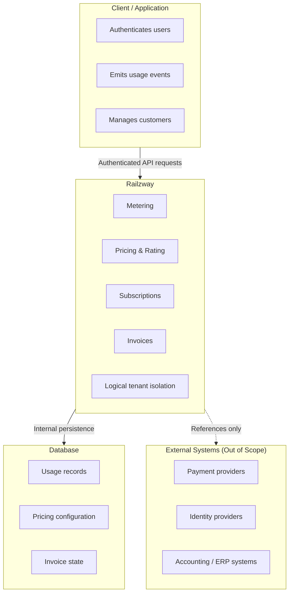

# Railzway — Architecture

## Overview

Railzway is an **open-source, industrial-strength billing engine** focused on **billing logic correctness**.

It is designed to extract billing concerns—usage metering, pricing, rating, subscriptions, and invoice generation—out of application code and into a **dedicated, deterministic engine**.

Railzway is intentionally **not** a payment processor.
It computes *what should be billed*, not *how money is collected*.

## Licensing & Open Source Status

Railzway is an **Open Source** project licensed under the **MIT License**. This allows you to freely use, modify, and distribute Railzway for any purpose, including commercial use.

This document describes how Railzway is structured, where its boundaries are, and why those boundaries exist.

---

## What Railzway Is (and Is Not)

Railzway **is**:

- A billing computation engine
- A control plane for pricing and usage-based billing
- A deterministic system for producing invoices and billing states

Railzway **is not**:

- A payment gateway
- A merchant of record
- A financial settlement system
- An infrastructure or operations platform

This distinction is fundamental to every architectural decision in Railzway.

---

## Architectural Intent

The architecture of Railzway is driven by three core intents:

1. **Billing logic must be isolated**Billing rules change faster than product logic. Hardcoding them into application flows creates long-term risk.
2. **Billing must be deterministic**Given the same inputs—usage, pricing configuration, subscription state, and time—Railzway must always produce the same result.
3. **Trust boundaries must be explicit**
   High-risk domains (payments, credentials, infrastructure) are deliberately kept outside the engine.

---

## High-Level Structure

At a high level, Railzway sits between the application and external financial systems.

The application:

- Owns users and authentication
- Emits usage
- Executes payments

Railzway:

- Validates and aggregates usage
- Applies pricing and rating rules
- Manages subscription and invoice state

External systems:

- Execute payments
- Handle identity
- Perform accounting or reconciliation

Railzway never crosses into payment execution.

---

## Core Runtime Flow

A typical billing lifecycle in Railzway looks like this:

1. The application defines billing primitives:

   - Products
   - Meters
   - Prices (flat, usage-based, tiered, hybrid)
   - Subscriptions
2. The application sends usage events to Railzway.
3. Railzway:

   - Validates usage against meter definitions
   - Aggregates usage per billing period
   - Applies pricing and rating logic
   - Computes billable line items
4. At the billing boundary:

   - An invoice is generated
   - Totals and line items are finalized
   - Invoice state transitions are recorded
5. The application consumes the invoice output and performs payment execution externally.

At no point does Railzway store or process payment credentials.

---

Railzway uses a **Unified Binary** approach (`cmd/railzway`) packaged into specialized Docker images:

### 1. Admin Image (`railzway-admin`)
- **Contains**: Monolith Binary + Admin UI Assets
- **Role**: Primary Control Plane. Serves the Admin Dashboard and the Core API.

### 2. Invoice Image (`railzway-invoice`)
- **Contains**: Monolith Binary + Invoice UI Assets
- **Role**: Customer-facing Checkout UI. Securely rendered public invoices.

### 3. Scheduler Image (`railzway-scheduler`)
- **Contains**: Monolith Binary (No UI Assets)
- **Role**: Background Plane. Runs async jobs (Rating, Invoicing).

### 4. Migration Image (`railzway-migration`)
- **Contains**: Monolith Binary (No UI Assets)
- **Role**: Ephemeral task runner for database schema migrations.

**Note**: All images run the exact same Go binary (`railzway`), ensuring consistent logic across all planes. The difference is only in the static frontend assets included and the command executed (`serve` vs `scheduler` vs `migrate`).

---

## Internal Composition

Internally, Railzway is structured in layered responsibilities:

- **API layer**

  - Handles HTTP/gRPC transport
  - Enforces authentication and authorization
  - Performs request validation
  - Contains no billing logic
- **Application / service layer**

  - Orchestrates billing workflows
  - Coordinates domain operations
  - Enforces state transitions and invariants
- **Domain layer**

  - Pricing models and rating logic
  - Subscription lifecycle rules
  - Invoice state machines
  - Designed to be deterministic and transport-agnostic
- **Persistence layer**

  - Stores usage records, pricing configuration, subscription state, and invoices
  - Abstracted behind repositories
  - Assumes database security is handled by the deployment environment

This separation exists to keep billing logic testable, auditable, and transferable.

---

## Trust Boundaries

Railzway operates across clearly defined trust boundaries.

---

## Idempotency & Entitlements

Railzway guarantees **strict idempotency** for usage ingestion to prevent double-billing.

### Entitlement "Drift" Protection

When a usage event is retried with the same `idempotency_key`, Railzway returns the **original result** of the first attempt.

- **Scenario**:
    1. Event A is ingested at T1 (Entitled: YES). Status: `Accepted`.
    2. Subscription is canceled at T2.
    3. Event A is retried at T3.
- **Result**:
    - The retry returns `Accepted` (matching the T1 result).
    - It does **NOT** re-evaluate entitlements against the T3 state.

This prevents "permission drift" where a valid event might be rejected on retry due to race conditions or network delays.

### Entitlements (Feature Access)

Entitlements are the durable record of which features a subscription is allowed to use.

1. Entitlements are created when a subscription is created or when subscription items are replaced.
2. One entitlement is created per feature attached to the subscribed product.
3. A metered feature must include a `meter_id`, otherwise the subscription change fails.
4. An entitlement is active when `effective_from <= t` and (`effective_to` is null or `t < effective_to`).
5. When a plan changes, existing entitlements are closed by setting `effective_to`, and new ones are created.

### Entitlements API (List)

`GET /subscriptions/{id}/entitlements`

Query parameters:
1. `effective_at` (optional): RFC3339 or `YYYY-MM-DD` to filter active entitlements at a point in time.
2. `page_token` (optional)
3. `page_size` (optional)

Response:
1. `data`: array of entitlements
2. `page_info`: cursor pagination info

Each entitlement includes: `id`, `subscription_id`, `product_id`, `feature_code`, `feature_name`, `feature_type`, `meter_id`, `effective_from`, `effective_to`, `created_at`.

### Strict Usage Gating

Usage ingestion is strictly gated by entitlements.

1. If no active entitlement exists for the meter at `recorded_at`, ingestion is rejected.
2. The error code returned is `feature_not_entitled` (HTTP 400).
3. Metered usage for a non-metered feature is rejected with the same error.
