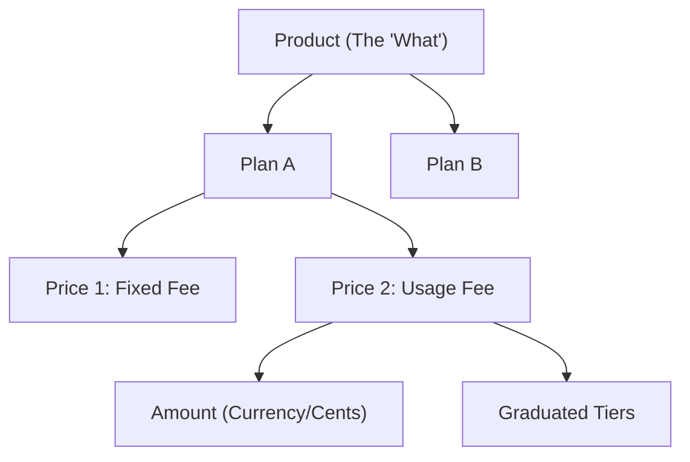

# Catalog Mental Model

Railzway uses a structured hierarchy to manage products, plans, and pricing logic. This document explains the relationship between these entities.

## Core Entities

### 1. Product
The highest-level container representing a major offering or service category.
- **Example**: "Cloud Infrastructure", "Enterprise Messaging".
- **Purpose**: Groups different pricing tiers (Plans) under a single logical brand.

### 2. Plan
A specific package or tier of a Product.
- **Example**: "Starter", "Professional", "Enterprise".
- **Purpose**: Defines what features and entitlements are included in the package.

### 3. Price (Plan Price)
Defines the billing logic for a Plan. A single Plan can have multiple Prices (Hybrid Billing).
- **Types**:
    - **Fixed/Recurring**: $50/month.
    - **One-time**: $100 setup fee.
    - **Usage-based (Metered)**: $0.01 per CPU hour.
- **Metered Connection**: When usage-based, the Price points to a `MeterID` to track relevant events.

### 4. Amount
The financial value (money) associated with a Price across different currencies.
- **Stores**: `unit_amount_cents` (to avoid rounding errors).
- **Currencies**: One price can have multiple amounts for different currencies (USD, IDR, etc.).

### 5. Tiers
Advanced pricing structures for volume-driven or graduated models.
- **Volume Pricing**: The price is determined by the total volume (e.g., all units at $0.08 if > 1000).
- **Graduated Pricing**: Different rates for different ranges (e.g., first 100: $0.10, next 900: $0.09).

---

## Data Hierarchy

## Why this model?
This separation allows Railzway to handle complex "Hybrid" billing scenarios where a customer is charged a flat subscription fee plus additional fees based on actual usage, often with volume discounts or caps.
